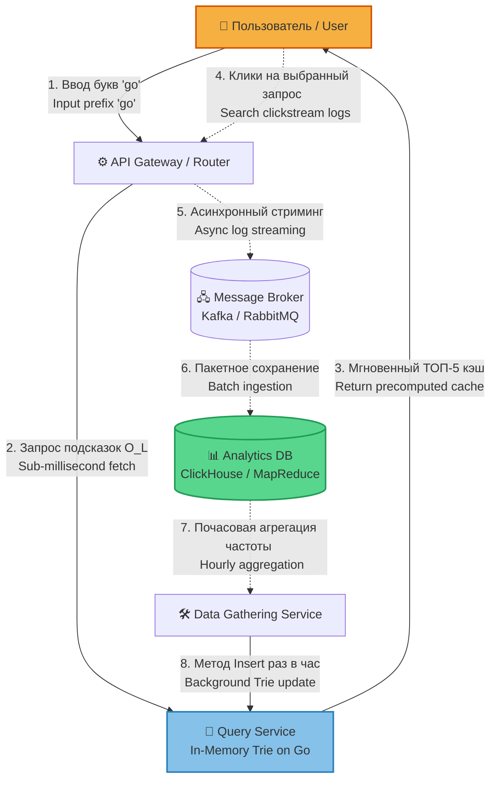
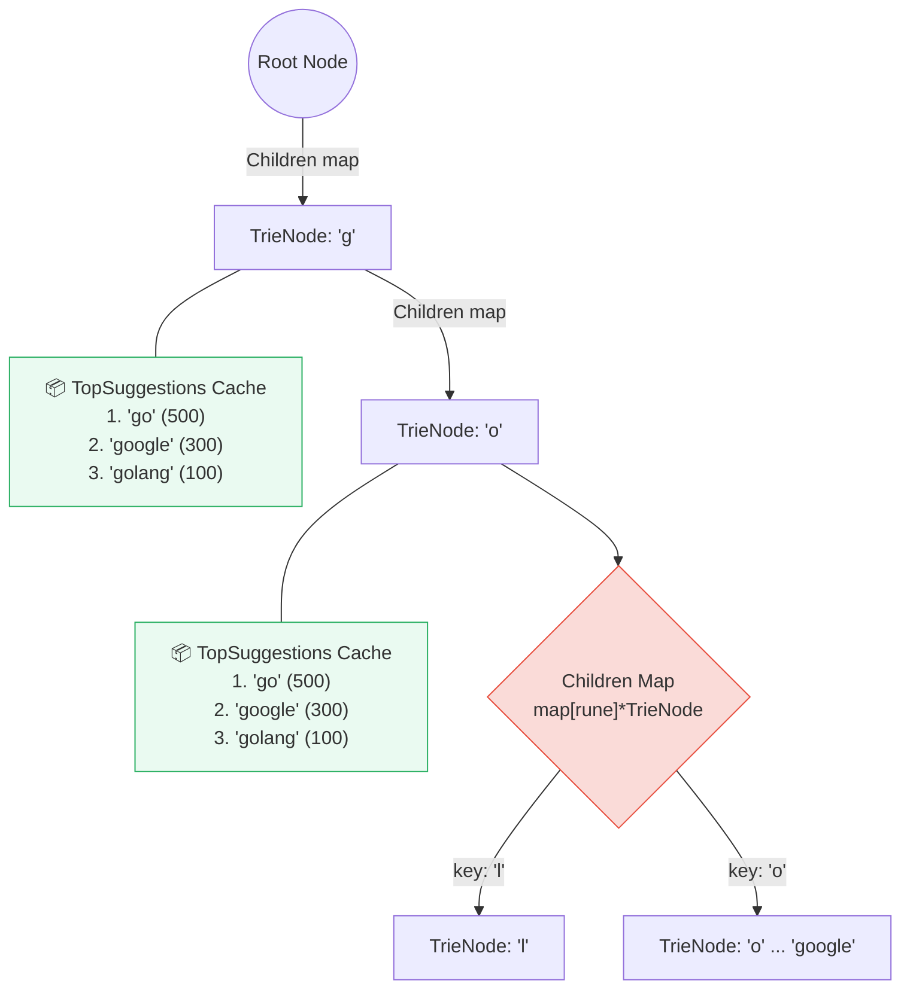

# High-Performance In-Memory Search Autocomplete System (Go)
## Высокопроизводительный сервис поисковых подсказок в оперативной памяти

This technical component delivers production-ready, sub-millisecond autocomplete suggestions tailored for high-scale System Design requirements (e.g., Wildberries, Ozon, or search engine input completion).

Данный технический компонент предоставляет промышленное решение для мгновенной генерации поисковых подсказок (автозаполнения) с субмиллисекундным временем ответа. Спроектировано с учетом требований Highload / System Design (масштабы Wildberries, Ozon, крупных поисковых движков).

## 1. Общая распределенная архитектура системы (High-Level System Design)

### Эта схема описывает паттерн, при котором тяжелая запись отделена от сверхбыстрого чтения (CQRS-подход).

## 2. Структура гибридного узла Trie в оперативной памяти (In-Memory Node Structure)

### Эта схема наглядно иллюстрирует ваш концепт: как в рамках одного узла уживаются дерево, хеш-таблица и готовый предрасчитанный массив подсказок.

---

### 🚀 Architecture Design & Trade-offs / Архитектурные особенности и компромиссы

#### 1. True $O(L)$ Search Time / Абсолютная скорость поиска $O(L)$
* **Problem / Проблема:** Standard Trie traversal via DFS/BFS to evaluate leaf frequencies on every read request completely chokes the CPU under massive concurrent traffic.
  Стандартный обход префиксного дерева через алгоритмы поиска (DFS/BFS) для оценки популярности слов на *каждый* пользовательский запрос парализует CPU при интенсивном параллельном трафике.
* **Solution / Решение:** Every individual node contains a precomputed, local cache slice (`TopSuggestions`) containing the top 5 overall globally popular strings sitting deeper downstream. Search query execution drops to a strict $O(L)$ constraint, where $L$ defines the input prefix length.
  Каждый отдельный узел содержит локальный, предрасчитанный кэш-срез (`TopSuggestions`), хранящий топ-5 глобально популярных строк, лежащих ниже по дереву. Поиск сводится к строгому константному ограничению $O(L)$, где $L$ — длина введенного пользователем префикса.
* **Trade-off / Компромисс:** We intentionally trade off a predictable memory footprint overhead (storing text suggestions redundantly along the search character branch) to achieve maximum CPU relief and lowest latency.
  Мы осознанно жертвуем небольшим избыточным объемом оперативной памяти (дублируя строки кэша вдоль символьных ветвей) ради достижения максимальной разгрузки процессора и минимального времени ответа (Latency).

#### 2. Tree-Map Hybrid Nodes / Гибридная структура узлов
* Instead of running fixed slice structures for character mappings, every `TrieNode` implements a hash-map `map[rune]*TrieNode`. This completely eliminates memory wastage on sparse/unpopulated alphabetic configurations while preserving immediate key access performance.
* Вместо статических массивов под алфавит, каждый `TrieNode` реализует хеш-таблицу `map[rune]*TrieNode`. Это исключает неэффективное расходование памяти на пустые символьные указатели, сохраняя мгновенную скорость перехода.

#### 3. Single-Writer / Multiple-Readers Pattern
* Read paths operate entirely under non-blocking read-locks (`sync.RWMutex.RLock()`), enabling thousands of concurrent goroutines to fulfill incoming autocomplete requests seamlessly. 
* Чтение данных выполняется под неблокирующими мьютексами (`sync.RWMutex.RLock()`), что позволяет тысячам параллельных горутин беспрепятственно вычитывать подсказки.
* Updates are designed to execute via batch processing (e.g., streaming aggregated search logs every minute) utilizing atomic locks to ensure real-time systems do not suffer write lock contention.
* Обновление популярности данных адаптировано под пакетную обработку (например, пролив агрегированных логов раз в минуту), исключая постоянную борьбу за блокировки записи.

---

### 📈 Scale & Distributed Strategies / Стратегии масштабирования и распределения

When the Trie structures grow beyond single-node memory allocations (e.g., tens of gigabytes of historical search query parameters), the following architectural transformations apply:
Когда размер префиксного дерева перерастает объем ОЗУ одной физической ноды (десятки гигабайт поисковой истории), применяются следующие паттерны:

1. **Horizontal Sharding (Consistent Hashing):** Distributing the prefix topology across independent server nodes utilizing a hash routing calculation: `Hash(prefix[:2]) % NumberOfServers`. This enforces an evenly distributed infrastructure load.
   **Горизонтальное шардирование:** Распределение дерева по независимым серверам на основе хэш-маршрутизации префиксов: `Hash(prefix[:2]) % NumberOfServers`. Это гарантирует равномерную утилизацию кластера.
2. **Evolution to Radix Tree:** Compressing nodes that contain single child relationships into linear substring indices (e.g., transitioning `[g]->[o]->[l]->[a]->[n]->[g]` to a combined node key `"golang"`). This optimizes pointer tracking overhead, shrinking memory demands by up to 50-70%.
   **Переход к Radix Tree (Сжатое дерево):** Схлопывание узлов, имеющих только одного потомка, в единые строки (переход от последовательности `[g]->[o]->[l]` к ключу `"gol"`). Это ликвидирует накладные расходы на указатели, снижая требования к ОЗУ на 50–70%.
