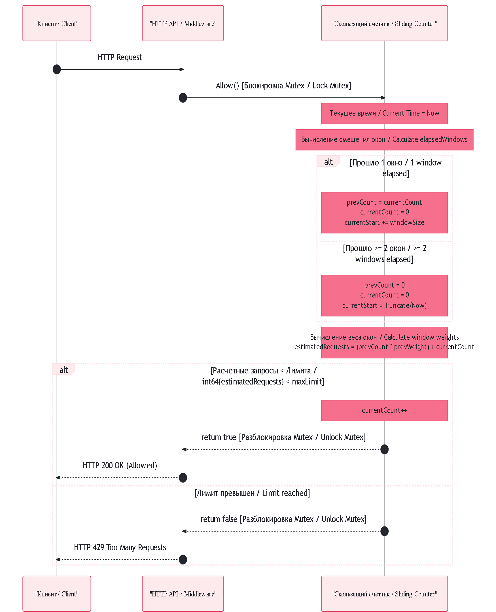
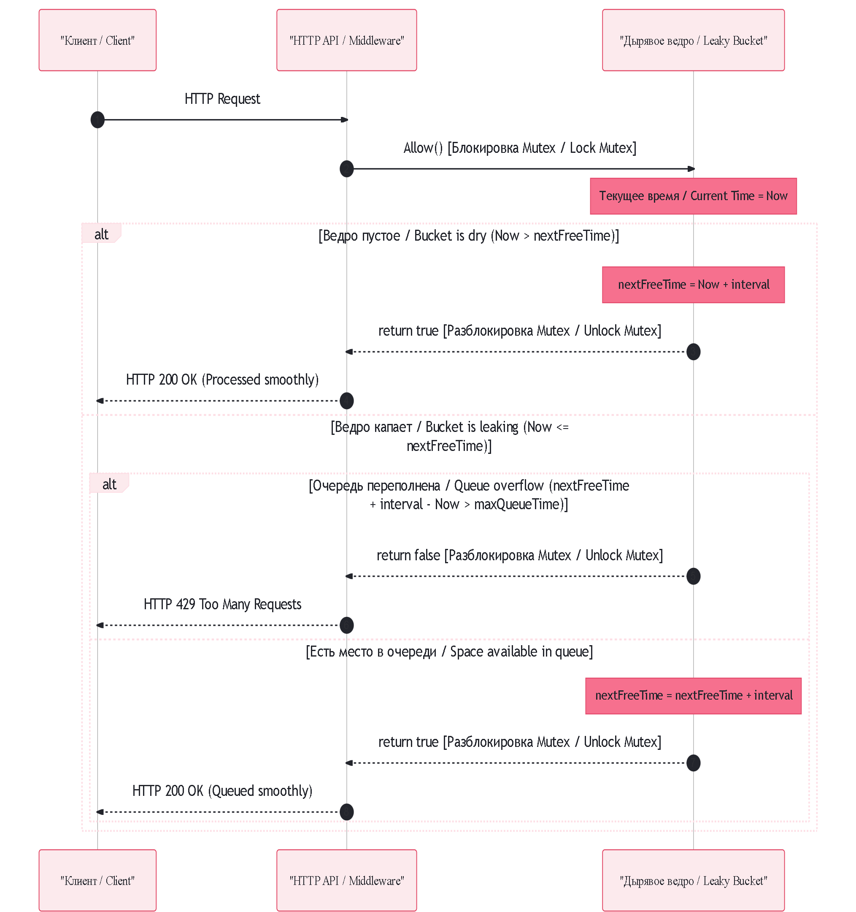
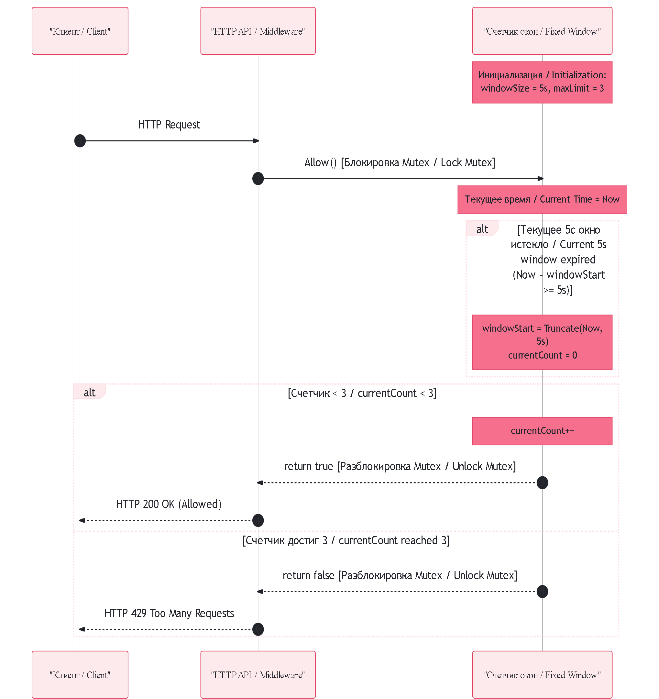
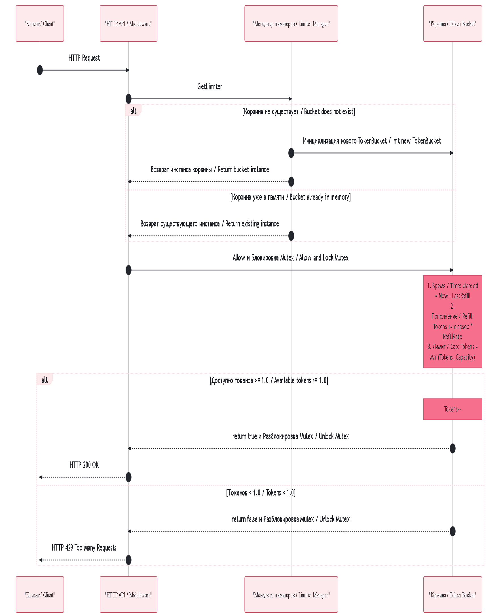

# Проектирование ограничителя трафика / designing a traffic limiter.

## Реализовано несколько алгоритмов:
* [счетчик скользящих интервалов (sliding window counter)](#счетчик-скользящих-интервалов-sliding-window-counter);
* [алгоритм дырявого ведра (leaking bucket)](#алгоритм-дырявого-ведра-leaking-bucket);
* [счетчик фиксированных интервалов (fixed window counter)](#счетчик-фиксированных-интервалов-fixed-window-counter);
* [алгоритм маркерной корзины (token bucket)](#алгоритм-маркерной-корзины-token-bucket);
* [журнал скользящих интервалов (sliding window log)](#журнал-скользящих-интервалов-sliding-window-log).

## Счетчик скользящих интервалов (sliding window counter). [Ссылка на раздел / Link to the section"](sliding-window-counter/)

## Алгоритм «Счетчик скользящих окон» (Sliding Window Counter)

### RU: Описание работы (Аппроксимация веса без горутин)
Алгоритм Sliding Window Counter сочетает в себе низкое потребление памяти, свойственное фиксированным окнам, и точность скользящего журнала. Вместо сохранения точных меток времени каждого запроса ($O(N)$ по памяти), данный подход оперирует исключительно числовыми счетчиками двух смежных окон (текущего и предыдущего), снижая пространственную сложность до неизменяемой константы $O(1)$.

#### Ключевые параметры:
*   `windowSize`: Фиксированная базовая дискретность сетки времени (например, 1 минута).
*   `currentCount` / `prevCount`: Количество успешных запросов в текущем и предыдущем изолированных окнах соответственно.
*   `currentStart`: Временная метка начала текущего активного интервала.

#### Логика обработки:
*   **Идентификация:** При поступлении HTTP-запроса система извлекает уникальный ключ клиента (`API-key`, `User-ID` или `IP`).
*   **Ленивая ротация:** Алгоритм проверяет, сколько целых окон `elapsedWindows` прошло с момента `currentStart`. Если прошло ровно одно окно, старый `currentCount` перемещается в `prevCount`, а текущий обнуляется. Если прошло два и более окон — оба счетчика сбрасываются в $0$.
*   **Расчет скользящего веса:** На основе текущего времени вычисляется пропорция протекшего интервала. Например, если в новом окне прошло $30\%$ времени, то вес старого окна принимается за $70\%$. Итоговая нагрузка рассчитывается математически: `estimatedRequests = (prevCount × 0.70) + currentCount`.
*   **Преимущества:** Алгоритм сглаживает граничные всплески (Boundary Burst), так как на стыке периодов вес предыдущего окна не позволяет пропустить избыточный трафик, сохраняя при этом фиксированный объем потребления оперативной памяти.

---

### EN: Workflow Description (Weight Approximation without Goroutines)
The Sliding Window Counter algorithm blends the low memory footprint of fixed-window trackers with the burst-protection accuracy of a rolling log. Instead of storing explicit execution timestamps for every incoming transaction ($O(N)$ spatial complexity), this model evaluates traffic using integer counters across two consecutive intervals (the current and previous windows), reducing runtime memory consumption to a strict $O(1)$ constant.

#### Core Parameters:
*   `windowSize`: The standardized base time duration segment (e.g., exactly 1 minute).
*   `currentCount` / `prevCount`: Aggregated execution counts for the current active and immediate previous windows.
*   `currentStart`: A timestamp signaling the starting boundary of the active tracking interval.

#### Processing Logic:
*   **Identification:** When an HTTP request arrives, the system extracts a unique identifier (`API-key`, `User-ID`, or `IP`).
*   **Lazy Grid Rotation:** The system checks how many full intervals (`elapsedWindows`) have passed since `currentStart`. If exactly one window duration has expired, `currentCount` transitions into `prevCount`, and the active tracker resets to $0$. If two or more windows have passed, both variables are flushed to $0$.
*   **Dynamic Weight Extrapolation:** The algorithm assesses the fraction of time elapsed in the active window. For example, if $30\%$ of the current window has passed, the previous window's contribution weight is valued at $70\%$. Total load estimation is derived mathematically via: `estimatedRequests = (prevCount × 0.70) + currentCount`.
*   **Advantages:** This architecture successfully mitigates boundary burst vulnerabilities. At the intersection lines of window rotations, the extrapolated historical weight flags and blocks artificial traffic surges while keeping memory usage at an absolute minimum.

## Алгоритм дырявого ведра (leaking bucket). [Ссылка на раздел / Link to the section"](leaking-bucket/)

### RU: Описание работы (Виртуальная очередь без горутин)
В отличие от классических академических реализаций, использующих внутренние очереди памяти и фоновые потоки (`time.Ticker`), данный компонент спроектирован по **DDoS-устойчивой математической модели**. Вместо физического удержания запросов в памяти, алгоритм оперирует исключительно **шкалой времени**.

#### Ключевые параметры:
*   `interval`: Минимально допустимый интервал времени между двумя выходящими запросами (вычисляется как `1 секунда / ratePerSec`).
*   `nextFreeTime`: Точка на временной шкале, показывающая, до какого момента вперед процессор гарантированно занят обработкой ранее принятых запросов.
*   `maxQueueTime`: Эквивалент емкости ведра, переведенный во время (`interval * maxQueueSize`).

#### Логика обработки:
1.  **Запрос на пустую систему:** Если текущее время (`Now`) больше, чем `nextFreeTime`, значит, система простаивала. Запрос пропускается мгновенно, а `nextFreeTime` сдвигается вперед на величину `interval`.
2.  **Запрос в момент нагрузки (Виртуальная очередь):** Если `Now` меньше или равно `nextFreeTime`, запрос пытается занять следующий свободный слот в будущем.
    *   **Переполнение:** Если добавление нового интервала сдвигает `nextFreeTime` слишком далеко в будущее (разница между новым `nextFreeTime` и `Now` превышает `maxQueueTime`), ведро считается переполненным. Алгоритм за $O(1)$ времени возвращает `false`, сбрасывая DDoS-трафик без выделения памяти.
    *   **Успешная вставка:** Если лимит не превышен, `nextFreeTime` сдвигается вперед на `interval`, а запрос успешно обрабатывается. Это гарантирует, что между обработкой любых двух успешных запросов всегда будет выдержана пауза, равная `interval`.

---

### EN: Workflow Description (Virtual Queue without Goroutines)
Unlike classic academic implementations that rely on in-memory arrays and background processing loops (`time.Ticker`), this component is built using a **DDoS-resilient mathematical model**. Instead of physically holding requests in memory buffers, the algorithm coordinates rate limiting entirely within the **time domain**.

#### Core Parameters:
*   `interval`: The strictly required duration between two departing requests (calculated as `1 second / ratePerSec`).
*   `nextFreeTime`: A timestamp indicating how far into the future the processing pipeline is already fully booked by prior operations.
*   `maxQueueTime`: The time-based equivalent of the physical bucket capacity (`interval * maxQueueSize`).

#### Processing Logic:
1.  **Idle System Request:** If the current timestamp (`Now`) is greater than `nextFreeTime`, it means the pipeline is idle. The request is processed immediately, and `nextFreeTime` is advanced forward by the `interval` value.
2.  **Active System Request (Virtual Queuing):** If `Now` is less than or equal to `nextFreeTime`, the incoming request attempts to reserve the next available slot in the future.
    *   **Overflow Boundary:** If adding the required interval pushes `nextFreeTime` too far into the future (the delta between the updated `nextFreeTime` and `Now` exceeds `maxQueueTime`), the bucket is considered overflowing. The algorithm executes in $O(1)$ complexity and returns `false`, dropping excess DDoS volumes immediately with zero memory allocation.
    *   **Successful Reservation:** If the queue boundary allows it, `nextFreeTime` is extended forward by one `interval`, and the request is successfully advanced. This guarantees that regardless of how dense the incoming traffic burst is, all surviving requests are smoothed out to leave the system with an exact `interval` delay between them.

## Счетчик фиксированных интервалов (sliding window counter). [Ссылка на раздел / Link to the section"](fixed-window-counter/)

## Конфигурация: Счетчик фиксированных интервалов (5 секунд, 3 запроса)

### RU: Описание работы (Fixed Window Configuration)
Строка инициализации `NewFixedWindowLimiter(5 * time.Second, 3)` настраивает лимитер на работу короткими статическими интервалами. Вся временная шкала разбивается на жесткие отрезки длительностью строго по 5 секунд каждый. Привязка к сетке и сброс счетчиков происходят автоматически в момент вызова метода проверки лимита.

#### Параметры конфигурации:
*   `windowSize` = `5 * time.Second`: Размер каждого фиксированного временного окна составляет ровно 5 секунд (например, интервалы `00:00–00:05`, `00:05–00:10`, `00:10–00:15`).
*   `maxLimit` = `3`: Суммарный лимит, разрешающий пропустить не более 3 запросов суммарно от одного источника внутри активного 5-секундного отрезка.

#### Логика обработки и поведение:
*   **Режим затишья:** Если пользователь совершает 3 запроса на первой секунде пятисекундного интервала, они успешно одобряются. Начиная со второй секунды и до самого конца этого интервала, любые новые запросы от этого пользователя будут мгновенно заблокированы.
*   **Автоматический сброс:** Как только время пересекает отметку окончания текущей 5-секундной зоны, приходящий запрос «лениво» сдвигает `windowStart` вперед, обнуляет счетчик, и пользователь снова получает право совершить до 3 запросов.
*   **Граничный всплеск (Уязвимость):** Данная конфигурация уязвима для атак на стыке окон. Пользователь может прислать 3 запроса на отметке `00:04.9` (конец первого окна) и еще 3 запроса на отметке `00:05.1` (начало второго окна). В результате за микроинтервал в 200 миллисекунд сервер обработает **6 запросов**, что в два раза превышает установленный лимит безопасности системы.

---

### EN: Configuration Analysis (5 Seconds, 3 Requests)
The initialization line `NewFixedWindowLimiter(5 * time.Second, 3)` configures the rate limiter to operate with short, static intervals. The continuous timeline is sliced into rigid time frames lasting exactly 5 seconds each. Grid alignment and counter resets occur automatically under the hood right at the moment the check method is evaluated.

#### Configuration Parameters:
*   `windowSize` = `5 * time.Second`: The strict duration of each fixed time window is exactly 5 seconds (e.g., intervals like `00:00–00:05`, `00:05–00:10`, `00:10–00:15`).
*   `maxLimit` = `3`: The maximum allowed capacity, permitting a combined total of no more than 3 requests from a single source within the active 5-second interval.

#### Processing Logic and Behavior:
*   **Burst and Block Pattern:** If a client executes 3 requests during the first second of a 5-second window, they are processed successfully. From the second second until the very end of that interval, any subsequent requests from this client will be instantly blocked.
*   **Automated Reset:** As soon as the system clock crosses the boundary of the current 5-second zone, the next incoming request reactively advances the `windowStart` timestamp, resets the counter to $0$, and the client is granted a fresh quota of up to 3 requests.
*   **Boundary Burst (Vulnerability):** This specific setup is highly susceptible to interlocking window attacks. A client can send 3 requests at `00:04.9` (tail end of the first window) followed immediately by 3 more requests at `00:05.1` (start of the next window). As a result, the server ends up processing **6 requests** within a tiny 200-millisecond span, effectively doubling the intended maximum system load.

## Алгоритм маркерной корзины (token bucket). [Ссылка на раздел / Link to the section"](token-bucket/)

### RU: Описание работы (Ленивое пополнение без горутин)
Алгоритм Token Bucket с ленивым пополнением (Lazy Refill) разработан специально для высоконагруженных систем и защиты от DDoS-атак. Его ключевое отличие от классической реализации на каналах и таймерах — полное отсутствие фоновых потоков (горутин), которые создают огромную нагрузку на планировщик и память при наплыве миллионов запросов. Вместо этого данный алгоритм использует чистую математику времени прямо в момент прихода запроса.

#### Ключевые параметры:
*   `capacity`: Максимальный лимит токенов (вместимость корзины), определяющий размер допустимого всплеска трафика.
*   `refillRate`: Скорость генерации токенов (сколько токенов строго добавляется в корзину за одну секунду).
*   `lastRefillTo`: Точная метка времени последнего успешного или отклоненного обращения к корзине.

#### Логика обработки:
*   **Идентификация:** При поступлении HTTP-запроса система извлекает уникальный ключ клиента (`API-key`, `User-ID` или `IP`).
*   **Ленивое пополнение (Lazy Refill):** Вместо ежесекундного добавления токенов, корзина вычисляет разницу между текущим временем и временем прошлого запроса (`elapsed`). Это значение умножается на `refillRate`, и полученное число виртуально добавляется к балансу.
*   **Защита от всплесков (Burst Limitation):** Баланс токенов жестко ограничивается максимальной емкостью (`capacity`). Это позволяет пользователю совершить кратковременную серию запросов (всплеск) после периода простоя, но предотвращает бесконечное накопление лимитов.
*   **Мгновенное решение:** Если после пополнения баланс содержит хотя бы $1.0$ токен, он уменьшается на $1$, и запрос немедленно пропускается ($O(1)$ по памяти и времени). Если токенов нет, функция мгновенно возвращает `false`, а сервер отвечает кодом `429 Too Many Requests`. Потоки сервера не блокируются, что делает систему неуязвимой для OOM (Out of Memory) при DDoS.

---

### EN: Workflow Description (Lazy Refill without Goroutines)
The Token Bucket algorithm with Lazy Refill is explicitly designed for high-throughput systems and DDoS mitigation. Its core advantage over traditional channel- or timer-based implementations is the complete elimination of background threads (goroutines), which degrade performance and consume unpredictable amounts of memory when processing millions of concurrent requests. Instead, this architecture relies on lazy evaluation based on timestamps right at the moment of request arrival.

#### Core Parameters:
*   `capacity`: The maximum token limit (bucket capacity) that defines the allowed size of a short-term traffic burst.
*   `refillRate`: The token generation speed (strictly how many tokens are added to the bucket per one second).
*   `lastRefillTo`: A precise timestamp indicating when the bucket was last accessed for evaluation.

#### Processing Logic:
*   **Identification:** When an HTTP request arrives, the system extracts a unique identifier (`API-key`, `User-ID`, or `IP`).
*   **Lazy Refill:** Rather than continuously pushing tokens into a channel via a background loop, the bucket updates its state reactively. It calculates the duration since the last check (`elapsed`) and multiplies it by the `refillRate`. This mathematically yields the number of tokens generated during the idle period.
*   **Burst Boundary Control:** The token balance is strictly capped at the maximum `capacity`. This allows legitimate clients to execute rapid back-to-back requests (bursts) after inactivity while ensuring that tokens cannot accumulate infinitely.
*   **Immediate Boundary Response:** If the updated balance holds at least $1.0$ token, the algorithm decrements it by $1$ and immediately grants access ($O(1)$ time and memory complexity). If insufficient, it abruptly returns `false`, triggers an HTTP `429 Too Many Requests` error, and frees up execution threads instantly. No goroutines are left parked or waiting, rendering the application highly resilient against Out-of-Memory (OOM) failures under heavy DDoS conditions.

## Журнал скользящих интервалов (sliding window log). [Ссылка на раздел / Link to the section"](sliding-window-log/)

### RU: Описание работы (Динамическое окно без горутин)
Алгоритм Sliding Window Log разработан для обеспечения абсолютной точности лимитирования и полной ликвидации уязвимости «всплеска на границе окон» (Boundary Burst), присущей статическим окнам. Вместо деления времени на жесткие сектора, алгоритм непрерывно сдвигает границы окна вслед за текущим моментом времени (`Now`). Для отслеживания истории каждый успешный запрос сохраняет свою точную метку времени в динамический массив (журнал).

#### Ключевые параметры:
*   `windowSize`: Продолжительность скользящего временного отрезка, отсчитываемая назад от текущей миллисекунды.
*   `maxLimit`: Максимально допустимое количество сохраненных запросов внутри плавающего интервала.
*   `log`: Внутренний слайс структур `time.Time`, хранящий историю пропущенных транзакций клиента.

#### Логика обработки:
*   **Идентификация:** При поступлении HTTP-запроса система извлекает уникальный ключ клиента (`API-key`, `User-ID` или `IP`).
*   **Динамическая очистка журнала:** Алгоритм вычисляет левую границу актуальности (`Now - windowSize`) и линейным перебором находит элементы журнала, совершенные раньше этой точки. Все устаревшие записи физически отрезаются от слайса, мгновенно освобождая квоты.
*   **Принятие решения:** Если текущая длина журнала `len(log)` строго меньше, чем `maxLimit`, текущая метка времени `Now` добавляется в конец слайса, а запрос успешно пропускается. В противном случае возвращается `false` (HTTP 429).
*   **Инженерный компромисс ($O(N)$ по памяти):** Алгоритм гарантирует идеальную защиту от DDoS-всплесков на стыке периодов. Однако платой за точность выступает неконтролируемый рост потребления памяти: при лимите в 10 000 запросов система вынуждена хранить 10 000 объектов времени для *каждого* активного пользователя, что делает структуру уязвимой к OOM-атакам при наплыве миллионов уникальных ботов.

---

### EN: Workflow Description (Dynamic Window without Goroutines)
The Sliding Window Log algorithm is engineered to deliver absolute precision in rate limiting, completely eliminating the "boundary burst" vulnerability inherent to fixed-window designs. Instead of slicing the timeline into rigid, stationary sectors, it continuously recalculates window parameters relative to the current timestamp (`Now`). To audit past traffic, every successful request stores its exact timestamp inside a dynamic array (log).

#### Core Parameters:
*   `windowSize`: The total duration of the sliding timeline, tracked backward from the current millisecond.
*   `maxLimit`: The maximum allowable request saturation ceiling within the moving interval.
*   `log`: An internal slice of `time.Time` values tracking a client's successful transaction history.

#### Processing Logic:
*   **Identification:** When an HTTP request arrives, the system extracts a unique identifier (`API-key`, `User-ID`, or `IP`).
*   **Dynamic Log Eviction:** The algorithm establishes a boundary threshold (`Now - windowSize`) and iterates through the log to identify markers registered prior to this moment. Stale indices are truncated from the slice, reactively freeing up capacity.
*   **Boundary Evaluation:** If the active log length `len(log)` is strictly below `maxLimit`, the current execution timestamp (`Now`) is appended to the slice, and access is immediately granted. Otherwise, it abruptly aborts, returning `false` (HTTP 429).
*   **Engineering Trade-off ($O(N)$ Memory Complexity):** While providing bulletproof defense against intersecting window bursts, this architecture introduces highly scalable memory overhead. For instance, a policy allowing 10,000 requests requires tracking 10,000 time objects for *every* unique user in memory, leaving the infrastructure exposed to potential Out-of-Memory (OOM) failures during low-intensity DDoS attacks spanning millions of botnets.
