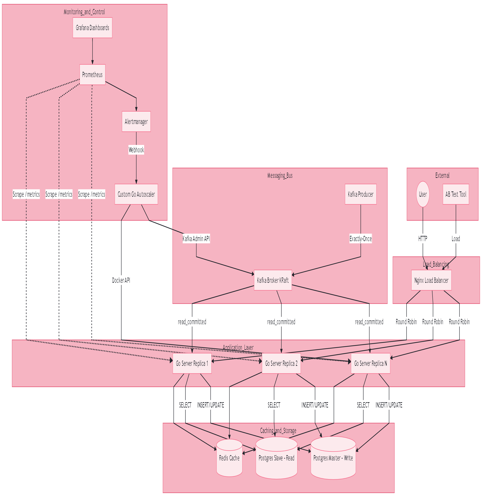

# Простая архитектура высокомасштабируемой системы / Simple High-Scalability System Architecture
### Данный проект демонстрирует реализацию отказоустойчивой и горизонтально, вертикально масштабируемой архитектуры на базе Docker Swarm.
### This project demonstrates the implementation of a fault-tolerant and horizontally scalable architecture based on Docker Swarm.

## 1. Диаграмма архитектуры / Architecture Diagram (Mermaid)


## 2. Компоненты системы / System Components

## Балансировка нагрузки / Load Balancing (Nginx) используется как входная точка (Reverse Proxy)

### Динамический DNS: настроен resolver 127.0.0.11, что позволяет Nginx видеть новые реплики сервисов через tasks.go-server без перезагрузки. Round Robin: Равномерно распределяет входящий трафик между всеми доступными контейнерами.

## Acts as the entry point (Reverse Proxy).

### Dynamic DNS: configured with resolver 127.0.0.11, allowing Nginx to discover new service replicas via tasks.go-server without restarts. Round Robin: Evenly distributes incoming traffic across all available containers.

## Слой приложения / Application Layer (Go Server)

### Контейнеризация: cборка на базе Alpine с поддержкой CGO для работы с Kafka. Graceful Shutdown: обработка сигналов завершения и проверка здоровья (Healthcheck) через зависимости БД и Redis
### Containerization: Alpine-based build with CGO support enabled for Kafka integration. Graceful Shutdown: proper termination signal handling and Healthchecks via DB and Redis dependencies.

## Брокер сообщений / Message Broker (Kafka)Exactly-Once Semantics (EOS): 

### Использование транзакционного продюсера и изоляции read_committed на консьюмере. KRaft Mode: современный режим работы без использования Zookeeper. 

### Exactly-Once Semantics (EOS): implementation of transactional producer and read_committed isolation level on the consumer side. KRaft Mode: modern operation mode without the need for Zookeeper.

## База данных / Database (Postgres Master-Slave)

### Разделение потоков: чтение (Read) идет со Slave-реплик, запись (Write) — только в Master.Репликация: потоковая репликация данных между узлами в реальном времени. Connection Pool: ограничение соединений для предотвращения перегрузки ресурсов БД. 

### CQRS Pattern: reads are directed to Slave replicas, while Writes go exclusively to the Master.  Replication: real-time streaming replication between database nodes. Connection Pool: limits concurrent connections to prevent database resource exhaustion.

## Кэширование / Caching (Redis)

### Используется для кэширования тяжелых SQL-запросов.

### Снижает нагрузку на Postgres, увеличивая общую пропускную способность (RPS).

### Used for caching heavy SQL query results.

### Reduces load on Postgres, significantly increasing overall throughput (RPS).

## Автомасштабирование / Autoscaling (Custom Go Autoscaler)

## Микросервис на Go, который:
### Принимает алерты от Prometheus через Alertmanager.

### Масштабирует количество реплик через Docker Socket API.

### Динамически увеличивает количество разделов (partitions) в Kafka для сохранения параллелизма.

## A Go-based microservice that:

### Receives alerts from Prometheus via Alertmanager.
### Scales service replicas using the Docker Socket API.
### Dynamically increases Kafka partition counts to maintain processing parallelism.

## Мониторинг / Monitoring (Prometheus & Grafana)

### Prometheus: сбор системных метрик (CPU, RAM) и бизнес-метрик (Cache Hit/Miss).
### Grafana: визуализация состояния кластера в реальном времени.

### Prometheus: collects system metrics (CPU, RAM) and business metrics (Cache Hit/Miss).
### Grafana: real-time visualization of the cluster state and performance.

# По умолчанию (начиная с Go 1.5) рантайм Go автоматически устанавливает это значение равным количеству доступных логических ядер процессора хост-машины. Но его можно изменять динамически прямо во время работы приложения (в рантайме).Однако при работе в Docker-контейнерах есть критически важные инженерные нюансы, о которых часто спрашивают на Senior-интервью.

# By default (starting from Go 1.5), Go runtime automatically sets this value to the number of available logical processor cores on the host machine. But it can be changed dynamically right during the operation of the application (in runtime).However, when working in Docker containers, there are critical engineering nuances that are often asked about in Senior interviews.

## Главная ловушка Docker + GOMAXPROCS (Crucial Interview Topic)Когда вы запускаете Go-сервер в Docker Swarm и ставите вертикальный лимит ресурсов:

## The main trap of Docker + GOMAXPROCS (Crucial Interview Topic)When you run a Go server in Docker Swarm and set a vertical resource limit:

```yaml
resources:
  limits:
    cpus: '0.50' # Выделили половину ядра
```

### Что видит хост: к машины, например, 8 ядер.
### What the host sees: the machine has, for example, 8 cores.
### Что делает Go по умолчанию: он вызывает runtime.NumCPU(), видит 8 ядер и ставит GOMAXPROCS = 8.
### What Go does by default: it calls runtime.NumCPU(), sees 8 cores, and sets GOMAXPROCS = 8.
### Что происходит под нагрузкой: go-рантайм честно пытается распределить свои системные потоки (OS threads) на 8 ядер процессора. но планировщик Linux (CFS) жестко ограничивает контейнер до 0.5 ядра.
### What happens under load: go-runtime is honestly trying to distribute its system threads (OS threads) across 8 processor cores. But the Linux Scheduler (CFS) strictly limits the container to 0.5 cores.
### Результат: возникает жуткий CPU Throttling. Потоки Go постоянно переключаются (Context Switch), тратя драгоценное время на конкуренцию друг с другом в рамках урезанного лимита. Производительность (RPS) падает, а задержки (Latency) растут.
### Result: terrible CPU Throttling occurs. Go streams are constantly switching (Context Switch), wasting valuable time competing with each other within a reduced limit. Performance (RPS) is falling, and Latency is increasing.

## Как это решается на практике (Библиотека от Uber)В реальном продакшене никто не меняет GOMAXPROCS вручную через HTTP-запросы. Вместо этого используют библиотеку automaxprocs от компании Uber.Она автоматически и динамически считывает лимиты из контрольных групп Linux (cgroups), под которые Docker загоняет контейнер, и сама выставляет правильный GOMAXPROCS в рантайме.

### Всё, что нужно сделать в вашем main.go:
### Everything you need to do in your main.go:
```go
package main

import (
	_ "go.uber.org/automaxprocs" // Достаточно просто импортировать с префиксом "_"
)

func main() {
	// Библиотека сама при старте (или изменении лимитов контейнера на лету)
	// выставит GOMAXPROCS = 1 (округлит 0.5 до ближайшего целого)
}
```

## Динамическое управление потоками / Dynamic Thread Management (GOMAXPROCS)Оптимизация под cgroups: использование рантайм-конфигурации runtime.GOMAXPROCS (через интеграцию uber-go/automaxprocs) позволяет Go-серверу динамически адаптировать внутренний планировщик под вертикальные лимиты контейнера Docker, предотвращая избыточное переключение контекста (Context Switching) и CPU Throttling.- Cgroups Optimization: utilizing runtime.GOMAXPROCS runtime configuration (via uber-go/automaxprocs integration) allows the Go server to dynamically adapt its internal scheduler to Docker container vertical limits, preventing excessive context switching and CPU throttling.


## Для лучшего понимания, систему нужно запустить и разобраться в коде! For a better understanding, you need to run the system and understand the code!

## Полезные команды/Useful commands:

### Сборка/Build:
```Terminal
docker-compose build
```
### Запуск/Launch:
```Terminal
docker stack deploy -c docker-compose.yaml my_stack
```
### Удаление/Delete:
```Terminal
docker stack rm my_stack
```

## 4. Шпаргалка команд терминала / CLI Cheat SheetТестирование нагрузки и автоскейлинга / Load & Autoscaling TestingДля запуска нагрузочного теста используйте утилиту Apache Benchmark (ab). Тест нужно запускать изнутри контейнера балансировщика, чтобы исключить сетевые ограничения хост-машины Windows (WSL2).To run the load test, use the Apache Benchmark (ab) tool. The test must be executed inside the load balancer container to bypass Windows host (WSL2) network bottlenecks.Поиск ID контейнера Nginx / Find the Nginx container ID:
```Terminal
docker ps | grep load-balancer
```
### Вход внутрь контейнера / Enter the container shell:
```Terminal
docker exec -it <CONTAINER_ID> sh
```

### Установка утилиты ab (только при первом входе) / Install ab tool (first time only):
```Terminal
apk add --no-cache apache2-utils
```

### Запуск теста на 500,000 запросов / Run 500,000 requests test:

```Terminal
ab -n 500000 -c 100 http://localhost/
```

### Мониторинг кластера в реальном времени / Real-Time Cluster MonitoringИспользуйте эти команды в терминале вашей хост-машины (Windows/Linux) во время проведения теста, чтобы отслеживать реакцию системы.Use these commands in your host terminal (Windows/Linux) during the test to monitor the system's response.Отслеживание изменения количества реплик / Track replica count changes:

```Terminal
# Для Linux/macOS (автообновление каждые 2 секунды)
watch docker service ls

# Для Windows (PowerShell alternative)
while($true) { clear; docker service ls; Start-Sleep -Seconds 2 }

```
### Просмотр детального состояния задач сервиса / View detailed service task states:

```Terminal
docker service ps my_stack_go-server
```
### (Позволяет увидеть, в каком состоянии находятся новые реплики: Preparing, Starting или Running).(Allows you to see the exact state of new replicas: Preparing, Starting, or Running).

### Анализ логов компонентов / Component Logs AnalysisКоманды для проверки работы транзакционной шины данных и пулов соединений.Commands to verify the transactional data bus and connection pool operations.Проверка Exactly-Once логов Продюсера / Verify Producer's Exactly-Once logs:

```Terminal
docker service logs -f my_stack_producer
```

### Проверка распределения чтения/записи в Go / Check Read/Write distribution in Go:

```Terminal
docker service logs -f my_stack_go-server
```

### (Ищите строки [MASTER] Connected, [SLAVE] Connected и сообщения из кэша/базы).(Look for [MASTER] Connected, [SLAVE] Connected lines, and cache/DB data source origins).Просмотр состояния репликации Postgres / View Postgres replication status:
### Просмотр состояния репликации Postgres / View Postgres replication status:

```Terminal
docker service logs -f my_stack_postgres-slave
```

### (Убедитесь, что Slave успешно подключился к Master в режиме стриминга).(Ensure the Slave has successfully connected to the Master in streaming mode).

```Terminal
docker service logs -f my_stack_postgres-slave
```

### Проверка инфраструктуры Kafka / Kafka Infrastructure VerificationПросмотр конфигурации топика и количества партиций / Describe topic configuration and partition counts:

```Terminal
docker exec -it $(docker ps -qf "name=my_stack_kafka") /opt/kafka/bin/kafka-topics.sh --bootstrap-server localhost:9092 --describe --topic events
```

### (Используйте эту команду до и во время теста, чтобы увидеть, как autoscaler динамически увеличивает параметр PartitionCount со старта с 3 партиций).(Use this command before and during the test to observe the autoscaler dynamically increasing the PartitionCount starting from 3 partitions).

### Очистка зависших задач и диагностика ошибок / Troubleshooting & CleanupЕсли сервис завис в состоянии 0/1 и логи не отображаются, Swarm отклонил задачу на этапе создания. Проверьте истинную причину ошибки (например, отсутствие образа или проблемы с правами на тома).If a service is stuck at 0/1 and shows no logs, Swarm rejected the task during creation. Check the root cause of the failure (e.g., missing image or volume permission issues).Просмотр системных ошибок Swarm / View Swarm system errors:

```Terminal
docker service ps --no-trunc my_stack_kafka
```

### Принудительный перезапуск сервиса без обновления кода / Force service restart without code updates:

```Terminal
docker service update --force my_stack_autoscaler
```