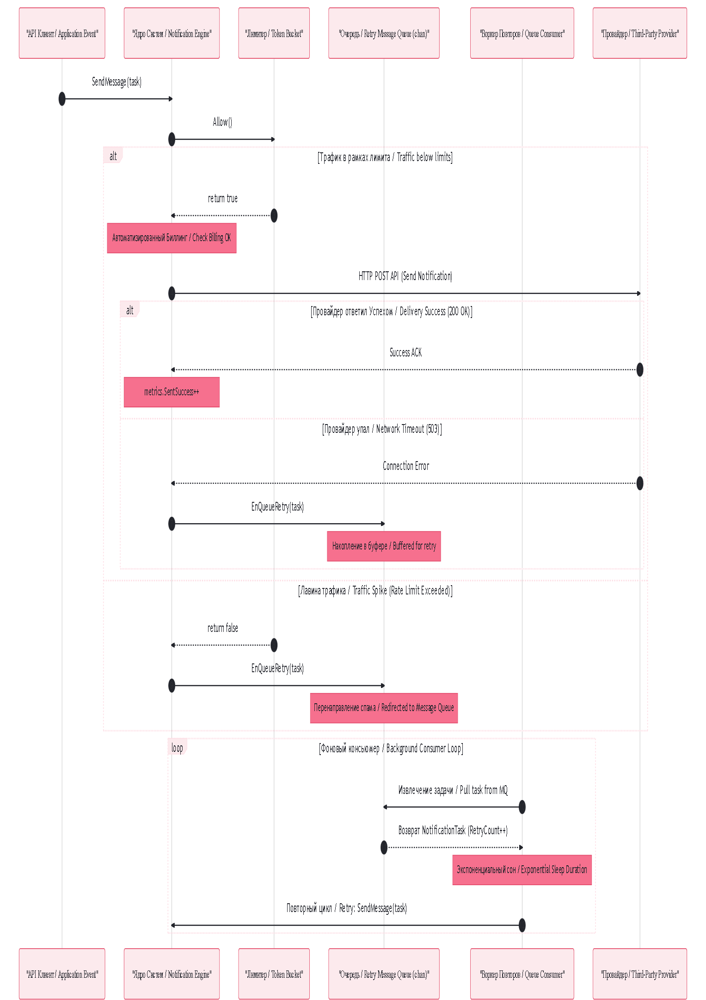

## Компоненты Системы Уведомлений (Notification System Architecture)

### RU: Описание архитектурных слоев и отказоустойчивости
Спроектированная система реализует паттерны асинхронной обработки и защиты от сбоев, описанные Алексом Сюем в главе по проектированию Notification-инфраструктуры масштаба Enterprise.

#### Ключевые компоненты:
1.  **Слой Базы Данных (Data Layer):** Схема нормализована. Таблица `User` хранит персональные контакты и географию (`country_code`, что критично для выбора SMS-провайдеров вроде Twilio по гео-признаку). Таблица `Device` вынесена отдельно с отношением один-ко-многим, так как у одного пользователя может быть несколько активных девайсов (iPhone, iPad) с уникальными токенами `device_token`.
2.  **система автоматизированного биллинга:** Финансовый фильтр отрабатывает строго *до* вызова тяжелых внешних провайдеров (SendGrid, FCM). Если у пользователя нет средств на балансе, задача мгновенно блокируется, не тратя сетевой трафик.
3.  **Ограничение трафика (Rate Limiting):** Алгоритм *Token Bucket* защищает внешних провайдеров от бана нашего сервиса за превышение лимитов API. Если наше приложение пытается отправить 100 писем за одну миллисекунду, лимитер плавно срезает всплеск. Запросы сверх лимита не уничтожаются, а отправляются в `retryQueue`.
4.  **Асинхронная Очередь Повторов (Message Queue / Retry Worker):** Сердце отказоустойчивости системы. Внешние API часто недоступны по сети (Network Timeout). Вместо падения всего потока, упавшая задача отправляется в буферизированный канал `retryQueue` (аналог RabbitMQ / Kafka). Фоновый воркер-консьюмер извлекает задачу, рассчитывает экспоненциальную задержку на основе `task.RetryCount` и бережно повторяет попытку отправки, гарантируя доставку **At-least-once (как минимум один раз)**.
5.  **Мониторинг и метрики (Observability):** Класс `NotificationMetrics` использует атомарные счетчики пакета `sync/atomic`. Это позволяет собирать статистику (успех, сбои, ретрии) со скоростью миллиард операций в секунду без блокировок процессора мьютексами, предоставляя точные данные для систем мониторинга вроде Prometheus/Grafana.

---

### EN: Architectural Layers and Fault Tolerance Breakdown
This multi-layered notification service is built directly upon the asynchronous ingestion and resilience standards defined in Alex Xu's Enterprise System Design documentation.

#### System Infrastructure Components:
1.  **Relational Storage Scheme (Data Layer):** The database schema is fully normalized. The `User` domain records core contact vectors and location metadata (`country_code`, which is essential for route optimization using SMS gateways like Twilio). The `Device` schema maps a 1-to-Many relation to accommodate users operating multiple concurrent form-factors (e.g., iPhone, iPad) with isolated `device_token` keys.
2.  **Automated Billing Gate:** Financial balance evaluation is executed strictly upstream from external, heavy API integrations (SendGrid, FCM). If account depletion is caught, the task aborts immediately, conserving bandwidth.
3.  **Throughput Ingress Shaper (Rate Limiting):** The internal *Token Bucket* state protects third-party provider limits from getting blocked due to API rate breaches. If the application outputs a traffic spike, the shaper smooths the curve. Dropped events are safely preserved by moving them directly into the `retryQueue`.
4.  **Asynchronous Message Queue & Consumer Loop:** The engine's core resilience layer. Third-party vendor environments frequently drop sockets due to transit timeouts. Instead of throwing runtime panics, failures migrate to the buffered `retryQueue` channel (acting as a local RabbitMQ / Kafka broker). A background background consumer picks up tasks, evaluates an exponential delay backed by `task.RetryCount`, and softly replays the request, enforcing rigid **At-least-once delivery** targets.
5.  **Observability & Metric Aggregation:** The `NotificationMetrics` struct leverages fast lock-free atomic counters from Go's `sync/atomic` core library. This architecture guarantees thread-safe tracing logs (success, failure, and retry counts) at processing speeds of billions of cycles per second without mutating pipeline lock barriers, outputting raw datasets directly for Prometheus/Grafana scrapers.
