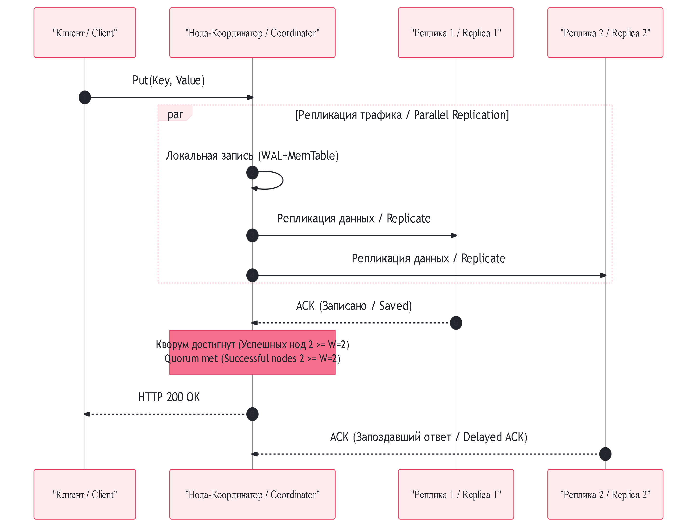

## Архитектура распределенного KV-хранилища (Distributed Key-Value Store)

### RU: Компоненты распределенной системы
Проектирование децентрализованного Key-Value хранилища (аналога Cassandra или Amazon DynamoDB) направлено на обеспечение масштабируемости, высокой доступности (High Availability) и отказоустойчивости. Система строится без единой точки отказа (Masterless Architecture), где все ноды кластера равноправны и координируют действия по сети.

#### 1. Репликация и Модель Кворума (Quorum N, W, R)
Для защиты от падения серверов и ЦОД данные реплицируются на несколько нод, находящихся на разных стойках или в разных регионах. Маршрутизация ключа к первой ноде-координатору происходит через **Согласованное хеширование**, а затем копия данных отправляется на $N$ следующих нод по часовой стрелке.
Согласованность настраивается через параметры кворума:
*   `N` — Фактор репликации (количество серверов, хранящих копию данных).
*   `W` — Кворум записи (сколько нод должны подтвердить успешный `Put`, чтобы клиент получил ответ OK).
*   `R` — Кворум чтения (с скольких нод нужно прочитать данные при `Get`, чтобы выбрать верный ответ).
*   **Правило строгого кворума ($W + R > N$):** Гарантирует, что пересечение множеств гарантированно содержит как минимум одну ноду с самой свежей версией данных, обеспечивая строгую согласованность (Consistency).

#### 2. Разрешение конфликтов (Векторные часы / Vector Clocks)
В распределенной системе физическое время на серверах рассинхронизировано. Метод Last-Write-Wins (по таймстампу) может приводить к потере данных. Для отслеживания причинно-следственных связей (Causality) используются **Векторные часы** — набор пар `[NodeID, Counter]`.
*   Если клиент обновляет данные через Ноду А, счетчик Ноды А увеличивается.
*   При возникновении сетевого расщепления (Network Partition) две ноды могут принять разные версии данных. Векторные часы позволяют зафиксировать конфликт (параллельные версии) и передать его клиенту для бизнес-разрешения на его стороне.

#### 3. Анти-энтропия и Деревья Меркла (Merkle Trees)
Для фоновой синхронизации данных между репликами и обнаружения расхождений используется криптографический алгоритм **Дерево Меркла (Хеш-дерево)**.
*   Вместо пересылки терабайтов данных по сети для сравнения, ноды строят дерево, где каждый листовой узел — это хеш пары "ключ-значение", а родительские узлы — хеши своих детей.
*   Ноды обмениваются только корневыми хешами деревьев. Если они совпадают, реплики идентичны. Если нет, ноды сравнивают ветви дерева сверху вниз, локализуя конкретный изменившийся диапазон ключей за $O(\log N)$ времени и минимизируя сетевой трафик.

---

### EN: Distributed System Components
Designing a decentralized, masterless Key-Value Store (akin to Cassandra or Amazon DynamoDB) focuses on horizontal scalability, High Availability, and Partition Tolerance. The system eliminates single points of failure by making all nodes equal co-operators interacting via peer-to-peer protocols.

#### 1. Replication and Quorum Tuning (N, W, R)
To secure data against hardware or data center crashes, keys are replicated across $N$ physical machines. Routing to the initial coordinator node is managed by **Consistent Hashing**, and the payload is then multi-cast to the next $N$ subsequent hosts clockwise on the ring.
Consistency trade-offs are governed via Quorum configurations:
*   `N` — Replication Factor (total number of nodes designated to host a copy of the data).
*   `W` — Write Quorum (the minimum number of node acknowledgments required for a successful `Put`).
*   `R` — Read Quorum (the minimum number of node responses required to return a value during a `Get`).
*   **Strong Quorum Rule ($W + R > N$):** Ensures that the read and write overlapping sets strictly intersect at a minimum of one node holding the latest version, yielding strong consistency guarantees.

#### 2. Conflict Resolution (Vector Clocks)
Physical wall-clock time cannot be trusted across distributed nodes due to clock drift. Relying on Last-Write-Wins timestamps can silently drop data. To track causality, **Vector Clocks** are introduced, structured as a set of `[NodeID, Counter]` vectors.
*   If a write is funneled through Node A, Node A's vector counter increments.
*   During a network partition, concurrent writes on split segments create branches. Vector clocks detect these conflicts mathematically, letting the system preserve both versions and push the reconciliation logic back up to the client application.

#### 3. Anti-Entropy with Merkle Trees
To synchronize data replicas in the background and fix data divergence, nodes execute an anti-entropy protocol utilizing **Merkle Trees (Hash Trees)**.
*   Instead of pipe-lining terabytes of raw data across the network to find inconsistencies, nodes convert key-value buckets into hierarchical hash structures where leaf nodes represent data hashes and parental nodes reflect hashes of their children.
*   Nodes exchange only the root hashes. If roots match, replicas are consistent. If not, nodes traverse the tree branches downward to isolate and transmit only the missing or mutated key ranges in $O(\log N)$ time, dramatically saving network bandwidth.
