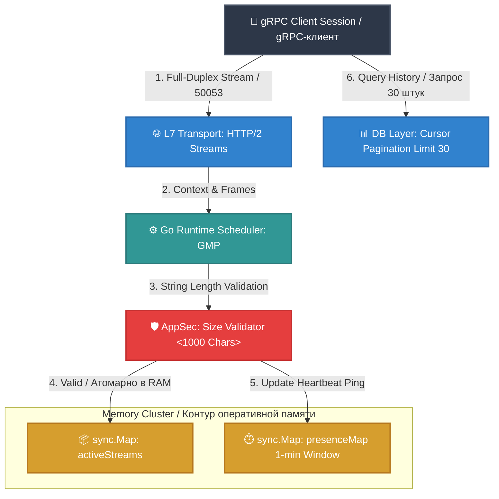

# 🏛️ Highload Instant Messaging System / Система мгновенного обмена сообщениями

[RU] Данный модуль реализует отказоустойчивое, Low-Latency ядро системы мгновенного обмена сообщениями на базе высокопроизводительного бинарного транспорта gRPC (HTTP/2). Архитектура спроектирована с учетом жестких требований к экономии памяти рантайма Go, лимитированию трафика и пагинации больших объемов данных.

[EN] This module implements a fault-tolerant, Low-Latency instant messaging core based on the high-performance gRPC (HTTP/2) binary transport. The architecture is designed considering strict requirements for Go runtime memory optimization, traffic shaping, and large-scale data pagination.

---

## 🗺️ System Architecture / Архитектура системы (Mermaid)

---

## 🛠️ Functional Capabilities & SRS Mapping / Функциональные возможности и ТЗ

### 1. Unified Room Topology / Единая топология комнат (Req. 1)
* **[RU]** Система абстрагирует личные переписки (1-on-1) и групповые чаты в единую сущность — **Room (Комната)**. Личный чат изолирован на уровне бизнес-логики ограничением массива участников до 2 ID. Это сокращает количество индексов в СУБД в 2 раза.
* **[EN]** The system abstracts private messages (1-on-1) and group chats into a single unified entity — **Room**. A private chat is isolated at the business logic layer by restricting the allowed users array to exactly 2 IDs. This reduces the number of database indexes by 50%.

### 2. In-Memory Heartbeat Presence / Скользящий статус присутствия (Req. 2)
* **[RU]** Мониторинг статуса «В сети / Был в сети» за последнюю минуту реализован через **In-Memory Heartbeat**. Каждое действие или пинг пользователя атомарно обновляет метку времени в потокобезопасной карте `sync.Map`. Исключен дисковый I/O оверхед. Если в течение 60 секунд пингов нет, система вычисляет точный час крайнего визита.
* **[EN]** Tracking the "Online / Last Seen" status within a rolling 1-minute window is implemented via **In-Memory Heartbeats**. Every user action or ping atomically updates the timestamp in a thread-safe `sync.Map`. This eliminates disk I/O overhead. If no pings occur within 60 seconds, the system calculates the exact last-seen timestamp.

### 3. Highload Cursor Pagination / Пагинация по курсору кусками по 30 штук (Req. 3 & 5)
* **[RU]** Выдача истории сообщений строго лимитирована кусками по 30 штук. Вместо деградационного паттерна `LIMIT/OFFSET`, заставляющего СУБД сканировать миллионы строк, применен **Cursor Pagination**. Запросы выполняются по B-Tree индексу (`WHERE room_id = X AND id < last_msg_id ORDER BY id DESC LIMIT 30`) за константное время $O(1)$. Подключение нового участника инициирует ленивую дозагрузку пропущенных пакетов по этой же схеме.
* **[EN]** Message history delivery is strictly limited to chunks of exactly 30 items. Instead of the degrading `LIMIT/OFFSET` pattern which forces the DB to scan millions of rows, **Cursor Pagination** is applied. Queries are executed via B-Tree index (`WHERE room_id = X AND id < last_msg_id ORDER BY id DESC LIMIT 30`) within constant $O(1)$ time. Connecting a new participant triggers a lazy-load sync of missed packets using the same scheme.

### 4. L7 Security: Buffer Flood Protection / Защита от переполнения буферов (Req. 4)
* **[RU]** Внедрена жесткая AppSec-валидация размера входящих сообщений до 1000 символов. Проверка выполняется на уровне L7-интерцептора до аллокации данных в постоянное хранилище с использованием `utf8.RuneCountInString`, что гарантирует корректный подсчет многобайтовых символов кириллицы и эмодзи. Тяжелые сетевые пакеты уничтожаются на входе в RAM.
* **[EN]** Strict AppSec validation limits the incoming message size to exactly 1000 characters. The check is performed at the L7 interceptor layer prior to data allocation in persistent storage using `utf8.RuneCountInString`, ensuring correct counting of multi-byte Cyrillic characters and emojis. Maliciously heavy payloads are dropped immediately upon entering RAM.

---

## 🚀 Infrastructure & Scaling / Инфраструктура и масштабирование

* **[RU]** Модуль полностью адаптирован под развертывание в кластере **Docker Swarm / Kubernetes**. Маршрутизация Full-Duplex бинарных потоков HTTP/2 между нодами кластера масштабируется за счет подключения распределенной шины данных Redis Pub-Sub / NATS.
* **[EN]** The module is fully adapted for deployment in a **Docker Swarm / Kubernetes** cluster. Routing of Full-Duplex HTTP/2 binary streams between cluster nodes scales seamlessly by connecting a distributed Redis Pub-Sub / NATS message bus.
