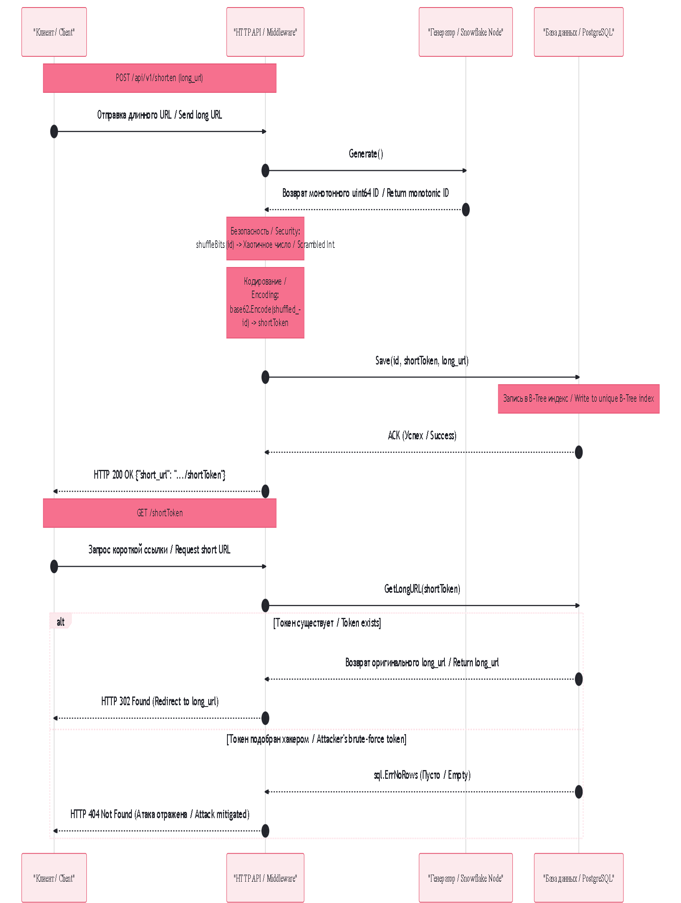

## Проектирование защищенной системы сокращения URL-адресов (Secure URL Shortener)

### RU: Описание работы и защита от перебора (Enumeration Attacks)
Данный компонент реализует отказоустойчивую и взломоустойчивую систему генерации коротких ссылок высокого уровня (Production-Ready URL Shortener). Вместо опасного подхода с использованием последовательного `AUTO_INCREMENT` или уязвимого к коллизиям хэширования (`MD5/SHA-256` со срезом символов), архитектура объединяет распределенную генерацию **Twitter Snowflake**, криптографическое перемешивание битов и кодирование по основанию **Base62**.

#### Ключевые компоненты архитектуры:
*   **Генератор Snowflake:** Отвечает за мгновенное ($O(1)$) выделение уникальных 64-битных числовых идентификаторов без обращений к сети или центральным базам данных.
*   **Битовый скрамблер (`shuffleBits`):** Маскирует монотонность Snowflake. С помощью каскадных XOR-сдвигов и умножения на магические константы, функция преобразует идущие подряд числа (например, `1, 2, 3`) в нелинейный хаотичный разброс. Это полностью ликвидирует уязвимость **Predictable ID**, делая невозможным подбор соседних ссылок методом перебора (Brute-Force).
*   **Base62 кодировщик:** Трансформирует перемешанное число в ультракомпактную строку, состоящую из символов `[a-zA-Z0-9]`, обеспечивая минимальную длину итогового URL (до 7-10 символов).
*   **PostgreSQL Хранилище:** Обеспечивает персистентность. Поиск оригинального длинного URL при редиректе происходит по уникальному текстовому полю через **B-Tree индекс**, гарантируя задержки выборки на уровне долей миллисекунды ($p99 < 1ms$).

#### HTTP-статус редиректа (302 Found):
В системе осознанно применен статус **302 Found (Временный редирект)** вместо **301 Moved Permanently**. Статус 301 кэшируется браузером намертво, что снимает нагрузку с бэкенда, но делает невозможным сбор бизнес-аналитики. Статус 302 заставляет каждый переход проходить через наше Go-приложение, позволяя вести точный учет количества кликов, географии и времени переходов в реальном времени.

---

### EN: Workflow Description and Enumeration Attack Mitigation
This component delivers a highly scalable, fault-tolerant, and secure URL shortening engine. Instead of relying on unsafe database auto-increments or collision-prone cryptographic truncation (`MD5/SHA-256`), the system implements a production-grade architecture combining **Twitter Snowflake distributed ID generation**, mathematical bit scrambling, and **Base62 alphabet encoding**.

#### Core Architectural Pillars:
*   **Snowflake ID Generator:** Facilitates instant ($O(1)$) allocation of unique 64-bit numerical keys without network coordination loops or centralized sequencing blocks.
*   **Bit Scrambler (`shuffleBits`):** Obfuscates the monotonic pattern of Snowflake. By chaining bitwise XOR shifts and multiplying variables by deterministic magic constants, it scrambles sequential sequences (e.g., `1, 2, 3`) into a highly chaotic distribution. This completely eliminates **Predictable ID vulnerabilities**, preventing attackers from scanning and reverse-engineering adjacent private user endpoints via brute-force or enumeration scripts.
*   **Base62 Encoder:** Compresses the scrambled 64-bit integer into a dense string layout leveraging `[A-Za-z0-9]` characters, yielding extremely short URL keys (typically within 7-10 characters).
*   **PostgreSQL Persistence Layer:** Guarantees data durability. Long URL evaluation during routing relies on a unique **B-Tree index**, keeping query fetch latencies within sub-millisecond ranges ($p99 < 1ms$).

#### HTTP Redirection Strategy (302 Found):
The API deliberately executes a **302 Found (Temporary Redirect)** instead of a **301 Moved Permanently**. While a 301 status triggers hard client-side browser caching (reducing server ingress load), it entirely blinds downstream business monitoring. Utilizing a 302 status forces every single clickstream transaction to hit our Go handler, unlocking comprehensive, real-time analytics tracking for click counters, device patterns, and geographical distributions.

