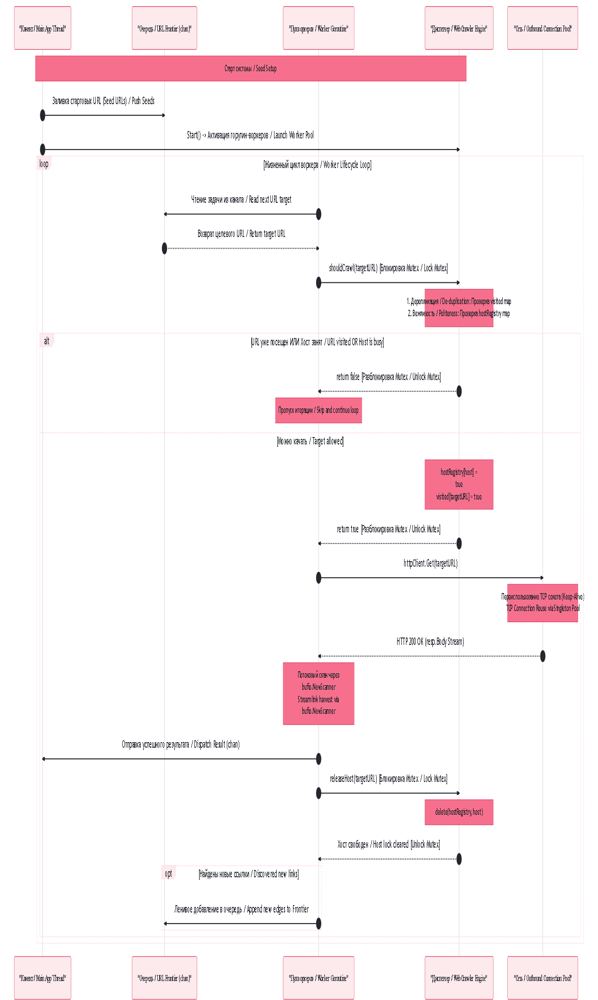

## Компоненты Поискового Робота (Web Crawler Architecture)

### RU: Принципы масштабируемости и отказоустойчивости
Реализованный поисковый робот полностью повторяет децентрализованную схему управления очередями (URL Frontier), описанную Алексом Сюем. В отличие от наивных рекурсивных краулеров, данная система не перегружает стек вызовов и лимитирована по ресурсам.

#### Ключевые механизмы:
1.  **Пул воркеров (Worker Pool):** Запросы выполняются фиксированным количеством горутин (`workerCount`). Это гарантирует предсказуемое потребление RAM и CPU процессора независимо от того, сколько миллионов ссылок находится в очереди.
2.  **URL Frontier на каналах:** Роль диспетчера задач выполняет буферизированный канал `chan string`. Воркеры пассивно блокируются на чтении из канала, автоматически распределяя нагрузку по мере освобождения потоков.
3.  **Дерепликация данных:** Карта `visited map[string]bool` защищает систему от зацикливания и бесконечного повторного скачивания одних и тех же страниц, гарантируя обработку уникального URL строго один раз.
4.  **Архитектура вежливости (Politeness):** Критический компонент Highload-краулера. Карта `hostRegistry` отслеживает активные сетевые сессии. Если один воркер прямо сейчас скачивает страницу с домена `habr.com`, другие воркеры мгновенно пропускают любые ссылки с этого же домена до тех пор, пока первый воркер не завершит I/O сессию и не очистит реестр. Это защищает сторонние веб-серверы от случайной DDoS-атаки со стороны нашего робота.

---

### EN: Scalability and Politeness Engineering
The implemented Web Crawler architecture enforces the task distribution standards (URL Frontier) outlined in Alex Xu's System Design blueprint. Rather than relying on fragile recursive sweeps, this runtime bounds internal stack execution constraints and enforces tight resource boundaries.

#### Architectural Pillars:
1.  **Worker Pool Model:** Outbound I/O loops execute within a strict, predefined set of concurrent goroutines (`workerCount`). This ensures deterministic memory footprints and CPU utilization constants regardless of how many million discovered nodes saturate the grid.
2.  **Channel-Based URL Frontier:** The buffered Go channel (`chan string`) serves as the core tasks scheduling dispatcher. Workers natively suspend execution while awaiting fresh tasks, balancing incoming infrastructure load reactively.
3.  **Data De-duplication Layer:** The `visited map[string]bool` structure acts as a tracking filter, locking out circular routing traps and preventing redundant re-fetches by ensuring each distinct target boundary is parsed exactly once.
4.  **Politeness Registry Control:** A non-negotiable asset for high-throughput scrapers. The `hostRegistry` coordinates active socket streams. If a worker thread is currently pulling blocks from `go.dev`, alternative workers immediately bypass incoming URLs associated with that specific host until the active I/O frame wraps up and evicts the lock. This protects downstream servers from unintended DDoS traffic spikes generated by our application.
