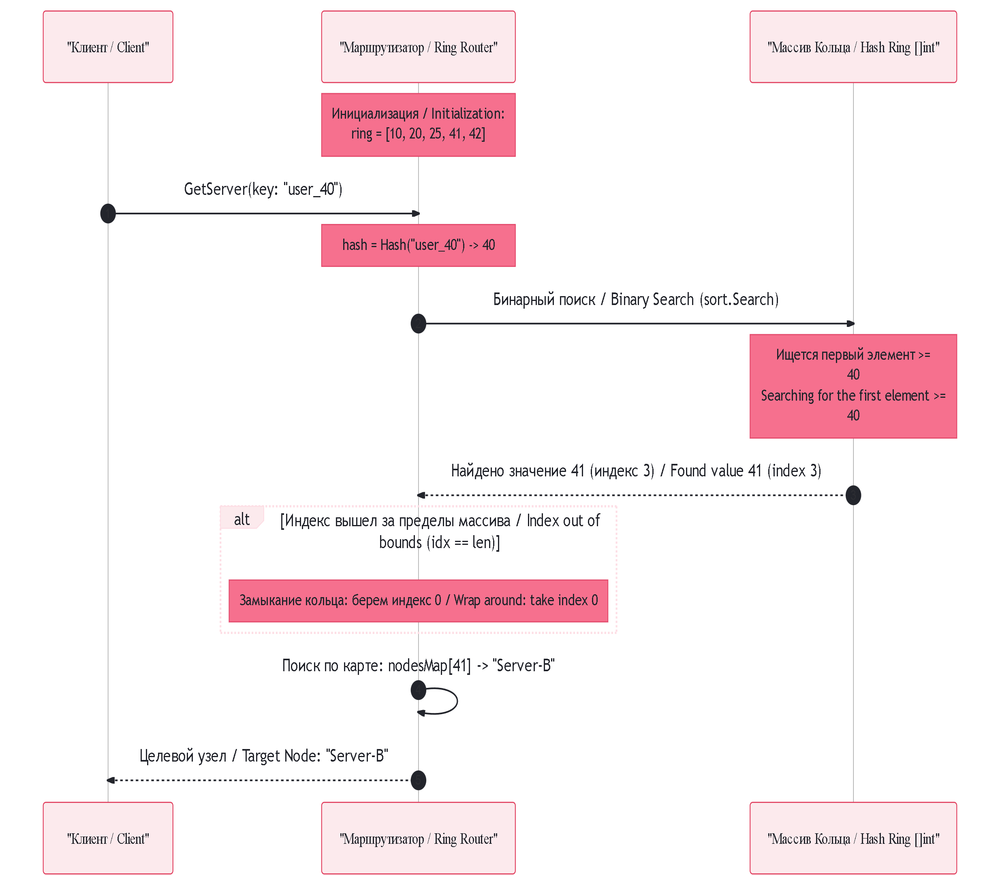

## Согласованное хеширование (Consistent Hashing)

### RU: Описание работы (Хэш-кольцо и виртуальные узлы)
Согласованное хеширование — это алгоритм распределения данных и маршрутизации запросов в горизонтально масштабируемых системах. В отличие от классического подхода `hash(key) % N`, где изменение числа серверов `N` приводит к полной инвалидации данных у $99\%$ пользователей, данный алгоритм при добавлении или удалении узла заставляет мигрировать лишь $1/N$ часть от общего объема ключей.

#### Ключевые параметры:
*   `ring`: Отсортированный массив (`[]int`), содержащий хэш-значения всех серверов (и их виртуальных копий). Представляет собой развернутую в линию шкалу виртуального кольца.
*   `vnodes`: Количество виртуальных узлов (Virtual Nodes) на один физический сервер. Используется для предотвращения дисбаланса нагрузки (Hotspots), равномерно перемешивая зоны ответственности серверов по всей шкале.
*   `nodesMap`: Хэш-карта (`map[int]string`), связывающая конкретную точку хэша на кольце с именем реального физического сервера.

#### Логика обработки:
*   **Имитация кольца (Геометрическая абстракция):** Для человека алгоритм проецирует серверы и ключи на замкнутый круг (от $0$ до $2^{32}-1$). Ключ закрепляется за тем сервером, который является ближайшим при движении от точки ключа по часовой стрелке.
*   **Физическая реальность процессора ($O(\log M)$ скорость):** Внутри оперативной памяти никакого круга нет. Рост чисел в отсортированном массиве — это математический эквивалент движения по часовой стрелке. При поиске сервера для ключа (например, с хэшем $40$), алгоритм выполняет **бинарный поиск** (`sort.Search`), мгновенно находя первое число в массиве, которое **больше или равно** хэшу ключа (в массиве `[10, 20, 25, 41, 42]` это будет число `41`).
*   **Замыкание кольца:** Если хэш ключа оказался больше всех доступных хэшей серверов (например, хэш $50$), бинарный поиск дойдет до конца массива. В этот момент срабатывает условие замыкания: алгоритм принудительно сбрасывает индекс в $0$, отправляя запрос на самый первый сервер в массиве (точка `10`), завершая виртуальный круг.
*   **Инженерный компромисс:** Алгоритм незаменим в распределенных системах, поскольку защищает сеть от глобальных миграций данных и «кеш-штормов». Однако его использование внутри RAM одной машины неэффективно: бинарный поиск требует $O(\log M)$ операций процессора, что значительно медленнее локальной хэш-таблицы с её константной скоростью $O(1)$.

---

### EN: Workflow Description (Hash Ring and Virtual Nodes)
Consistent Hashing is an advanced algorithmic framework designed for predictable data distribution and request routing across horizontally scalable clusters. Unlike the traditional remainder-based hashing technique (`hash(key) % N`) — where modifying the node count `N` instantly invalidates up to $99\%$ of the cluster's cache lookup addresses — consistent hashing boundaries ensure that adding or evicting a cluster node only forces the migration of a minor $1/N$ fraction of the aggregate keyspace.

#### Core Parameters:
*   `ring`: A sorted slice of integers (`[]int`) holding computed hash metrics of physical servers and their virtual duplicates. This structures the unrolled scalar representation of the virtual ring topology.
*   `vnodes`: The allocation quota of Virtual Nodes mapped to each distinct physical machine. This parameter prevents load imbalances (hotspots) by smoothly interleaving nodes' resource spans uniformly across the keyspace.
*   `nodesMap`: A structural translation hash map (`map[int]string`) pairing specific scalar hash marks on the ring back to their primary underlying physical server names.

#### Processing Logic:
*   **Ring Simulation (Mental Abstraction):** Conceptually, the architecture models nodes and client keys onto a continuous geometric circle (ranging from $0$ to $2^{32}-1$). A key is bound to the respective server that stands closest to its entry position when navigating the circumference strictly clockwise.
*   **CPU Internal Execution ($O(\log M)$ Time Complexity):** Within memory arrays, circular space does not exist. Ascending integer values inside a sorted array serve as the direct mathematical substitute for a clockwise vector. To locate a key's host (e.g., target hash $40$), the routine invokes a fast **binary search** (`sort.Search`), instantly capturing the earliest item that is **greater than or equal to** the key's value (yielding `41` in a dataset like `[10, 20, 25, 41, 42]`).
*   **Ring Boundary Wrap-Around:** If an incoming key hash exceeds the highest registered cluster marker (e.g., hash value $50$), the binary search overshoots the array length boundaries. This activates the circular rollover condition: the routine forcibly dampens the offset position back to index $0$, routing the query to the initial server in the array (point `10`), completing the virtual loop.
*   **Engineering Trade-off:** This layout is mandatory for distributed environments because it shields the networking mesh from systemic split-brain re-sharding storms. However, deploying a hash ring inside a single machine's local RAM is counter-productive: a binary lookup incurs an $O(\log M)$ execution penalty, which lags substantially behind the true $O(1)$ constant latency provided by low-level hardware hash-table slot jumps.
